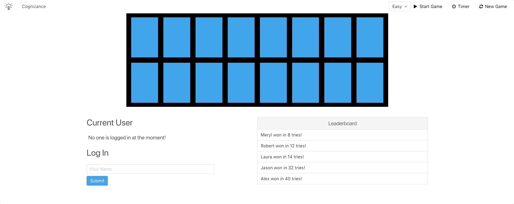

# Cognizance

## Description
This is a demo for Cognizance, a cognitive learning memory game built in JavaScript with a Ruby on Rails backend. The purpose of the game is to find the pairs for all cards that match as quickly as possible, with as few clicks as possible.

**The live application can be found [here](https://cognizance-game.herokuapp.com/).**

## Core Features
1. [Immediate Validation on Card Flip](#immediate-validation-on-card-flip)
2. [Increasing Levels of Difficulty](#increasing-levels-of-difficulty)
3. [User Account Creation](#user-account-creation)
4. [Real Time Leaderboard Updates](#real-time-leaderboard-updates)
5. [Responsive Game Refresh](#responsive-game-refresh)

### Immediate Validation on Card Flip
When a user chooses a difficulty and starts the game, there is a countdown during which all functionality for the board where the cards are rendered is disabled. Once the game begins, a timer starts to keep track of the duration of the game. A user can click on a card in intervals of two at a time.

The game logic accounts for matches in images by leaving them flipped with the image displayed for the remaining portion of the game and making both cards static with all click actions for those specific cards disabled. If the card images do not match, they are flipped back to the back face of the card and will continue to have the functionality to click and flip them until the match is found and the action disabled.

### Increasing Levels of Difficulty
There are four levels of difficulty:
  - Basic: One row of cards is rendered for understanding how the game should function in its most simplest form
  - Easy: Two rows of cards are rendered for initial skill-building once a user gets comfortable with the basic version
  - Medium: Three rows of cards are rendered for intermediate skill-building once a user is able to complete the Easy level with minimal amount of clicks
  - Hard: Four rows of cards are rendered for advanced skill-building once a user is able to complete the Medium level with the fewest clicks possible

Upon opening the game, it will default to the "Basic" level so a user can get familiar with the game functionality.

### User Account Creation
The game will account for whether or not a user is logged in. When there is no one logged in, it will display a message to notify the user of it.

Once the user enters the name, the message will update to render the current user based on the user input.

### Real Time Leaderboard Updates
When a user matches all of the cards, the entire board will become disabled.

The timer will stop and a message will render over the game board with the amount of tries the user took and the amount of time it took them to complete the game.

If a user has completed the game with a score higher than what is currently on the leaderboard, it will update immediately after the end of the game to reflect this new score. Originally, the user "Meryl" is listed in the number one spot on the leaderboard but since the user "Laura" completed the game in less tries, the user "Laura" replaced "Meryl" on the leaderboard and "Meryl" was bumped down a spot.

### Responsive Game Refresh
A user has the option to end their current game, regardless of their level of completion, and start a completely new game if desired.

For example, if a user was playing the game on a difficulty level of "Medium" and decided to continue training on a less advanced level, the user could click the "New Game" button and thus refreshing the entire board and timer.

